# Spatial Feature Clustering in Visium Transcriptomics

A modular Python pipeline for multi-view gene clustering on **10x Genomics Visium** spatial transcriptomics data. It combines expression similarity with spatial structure to identify biologically meaningful gene modules.

---

## Key Features

| Capability | Description |
|---|---|
| **Multi-View Clustering** | Compare gene groupings across expression-only, spatial-filtered, MoG-binarized, and weighted hybrid views using Louvain, Leiden, or Spectral clustering. |
| **Spatial Filtering** | Mean filter, expansion filter, and Mixture-of-Gaussians binarization to enhance spatial signal before similarity computation. |
| **Hybrid Similarity** | Weighted combination of expression, spatial, and MoG similarity matrices (α·Expr + β·Spatial + γ·MoG). |
| **Automatic Resolution Optimization** | Grid search over the resolution parameter, maximizing Silhouette score or Moran's I. |
| **Weight Sensitivity Analysis** | Systematic grid search over (α, β, γ) weight space to identify robust parameter ranges. |
| **Explicit PCA Preprocessing** | Configurable dimensionality reduction before neighbor computation (default: 50 components). |
| **Comprehensive Evaluation** | Silhouette, Calinski-Harabasz, Davies-Bouldin, ARI, NMI, and Moran's I spatial autocorrelation. |
| **Report Generation** | Automated HTML/PDF reports with embedded plots, metric explanations, and sensitivity analysis results. |

---

## Repository Structure

```
spatial-feature-clustering/
├── src/
│   ├── data/
│   │   └── data_loader.py                 # SpatialDataset — Visium data loader
│   ├── preprocessing/
│   │   └── spatial_filters.py             # SpatialFilterBank — mean, expansion, MoG, PCA
│   ├── visualization/
│   │   └── plots.py                       # SpatialPlotter — diagnostic & spatial plots
│   ├── similarity/
│   │   ├── base_similarity.py             # Abstract similarity interface
│   │   ├── alternative_similarity.py      # Pearson, Spearman, Cosine implementations
│   │   └── spatial_weighted_similarity.py # Weighted hybrid similarity metric
│   ├── clustering/
│   │   ├── gene_clustering.py             # GeneClustering — Louvain / Leiden / Spectral
│   │   ├── multiview_clustering.py        # MultiViewClustering — multi-view orchestrator
│   │   └── resolution_optimizer.py        # ResolutionOptimizer — automatic resolution search
│   ├── evaluation/
│   │   ├── metrics.py                     # ClusteringEvaluator — quality & spatial metrics
│   │   └── weight_sensitivity.py          # WeightSensitivityAnalyzer
│   └── utils/
│       ├── config.py                      # YAML configuration loader
│       ├── logger.py                      # Logging setup
│       └── session.py                     # SessionManager — run tracking & artifact storage
│
├── notebooks/
│   ├── 01_explore_dataset.ipynb           # Exploratory data analysis
│   ├── 02_baseline.ipynb                  # Expression-only baseline clustering
│   ├── 03_spatial_weighted_similarity.ipynb # Weighted hybrid clustering
│   ├── 04_multiview_clustering.ipynb      # Multi-view comparison
│   ├── 05_final_plots.ipynb               # Publication-ready figures
│   └── 06_sensitivity_analysis.ipynb      # Parameter optimization & validation
│
├── scripts/
│   └── generate_report.py                 # HTML/PDF report generator
│
├── data/
│   └── DLPFC-151673/                      # Visium dataset (not tracked by git)
│
├── results/
│   └── runs/                              # Session artifacts (plots, metrics, logs)
│
├── examples/
│   ├── run_2026-02-10_04-27-21/          # Example results with default parameter
│   └── run_2026-02-10_05-29-59/          # Example results with optimized parameter
│
├── config.yaml            # Pipeline configuration (profiles: default, optimized, auto_optimize)
├── environment.yml        # Conda environment specification
├── requirements.txt       # pip dependencies
├── run.ps1                # PowerShell automation script (Windows)
├── makefile               # Make targets (Linux / macOS / WSL2)
└── dockerfile             # Docker container build
```

---

## Pipeline Overview

```mermaid
flowchart TD
    classDef step fill:#1f77b4,stroke:#0d3a63,stroke-width:1px,color:white
    classDef module fill:#2ca02c,stroke:#145214,stroke-width:1px,color:white
    classDef notebook fill:#ff7f0e,stroke:#a64b00,stroke-width:1px,color:white
    classDef result fill:#9467bd,stroke:#4b2e7f,stroke-width:1px,color:white

    A[Load Visium Dataset<br/>01_explore_dataset]:::notebook
    B[SpatialDataset<br/>data_loader.py]:::module
    C[Select Top 300 Spatially Variable Genes]:::step

    D1[Baseline Similarities<br/>Pearson / Spearman / Cosine]:::module
    D2[Spatial Filters<br/>Mean / Expansion / MoG]:::module
    D3[Spatial Weighted Similarity<br/>α·Expr + β·Spatial + γ·MoG]:::module
    D4[Multi-View Similarities<br/>4 representations]:::module

    E1[Baseline Clustering<br/>02_baseline]:::notebook
    E2[Weighted Clustering<br/>03_spatial_weighted]:::notebook
    E3[Multi-View Clustering<br/>04_multiview]:::notebook

    F[Evaluation<br/>Silhouette / ARI / NMI / Moran's I]:::module
    G[Final Plots & Report<br/>05_final_plots]:::notebook
    G2[Sensitivity Analysis<br/>06_sensitivity]:::notebook
    H[Results<br/>plots / metrics / report.html]:::result

    A --> B --> C
    C --> D1 & D2 & D3 & D4
    D1 --> E1
    D3 --> E2
    D4 --> E3
    E1 & E2 & E3 --> F --> G --> H
    F --> G2 --> H
```



---

## Getting Started

### Prerequisites

- **Python 3.10+**
- One of: Conda, pip, Docker, or PowerShell (Windows)
- A 10x Genomics Visium dataset (see [Dataset Preparation](#dataset-preparation))

### Installation

Choose one of the following methods:

#### Conda (recommended)

```bash
conda env create -f environment.yml
conda activate spatial-clustering
```

#### pip

```bash
python -m venv .venv
# Linux/macOS
source .venv/bin/activate
# Windows (PowerShell)
.\.venv\Scripts\Activate.ps1

pip install -r requirements.txt
```

#### PowerShell (Windows)

```powershell
.\run.ps1 setup          # Creates the conda environment
.\run.ps1 notebook       # Launches Jupyter Lab with PYTHONPATH configured
```

#### Make (Linux / macOS / WSL2)

```bash
make setup               # Creates the conda environment
make run-notebook         # Launches Jupyter Lab
```

#### Docker

```bash
docker build -t spatial-clustering .
docker run -it -p 8888:8888 -v ./data:/app/data spatial-clustering
```

### Dataset Preparation

Place your Visium dataset in `data/DLPFC-{sampleID}/` with the following structure:

```
data/DLPFC-{sampleID}/
├── filtered_feature_bc_matrix.h5    # Gene expression matrix (required)
└── spatial/                         # Visium spatial information (required)
    ├── tissue_hires_image.png       # H&E tissue image (high-res)
    ├── tissue_lowres_image.png      # H&E tissue image (low-res)
    ├── scalefactors_json.json       # Spatial calibration factors
    └── tissue_positions_list.csv    # Spot coordinates
```

#### Available DLPFC Samples

This pipeline uses data from the [spatialLIBD](http://spatial.libd.org/spatialLIBD/) project — 12 human DLPFC samples profiled with 10x Genomics Visium. The default sample is **DLPFC-151673**.

| Sample ID | Subject | Position | Download |
|-----------|---------|----------|----------|
| 151507 | Br5292 | 0 | [spatialLIBD](https://github.com/LieberInstitute/spatialLIBD) |
| 151508 | Br5292 | 1 | [spatialLIBD](https://github.com/LieberInstitute/spatialLIBD) |
| 151509 | Br5595 | 0 | [spatialLIBD](https://github.com/LieberInstitute/spatialLIBD) |
| 151510 | Br5595 | 1 | [spatialLIBD](https://github.com/LieberInstitute/spatialLIBD) |
| 151669 | Br6432 | 0 | [spatialLIBD](https://github.com/LieberInstitute/spatialLIBD) |
| 151670 | Br6432 | 1 | [spatialLIBD](https://github.com/LieberInstitute/spatialLIBD) |
| 151671 | Br6522 | 0 | [spatialLIBD](https://github.com/LieberInstitute/spatialLIBD) |
| 151672 | Br6522 | 1 | [spatialLIBD](https://github.com/LieberInstitute/spatialLIBD) |
| **151673** | **Br8100** | **0** | [spatialLIBD](https://github.com/LieberInstitute/spatialLIBD) |
| 151674 | Br8100 | 1 | [spatialLIBD](https://github.com/LieberInstitute/spatialLIBD) |
| 151675 | Br8325 | 0 | [spatialLIBD](https://github.com/LieberInstitute/spatialLIBD) |
| 151676 | Br8325 | 1 | [spatialLIBD](https://github.com/LieberInstitute/spatialLIBD) |

Raw data can also be accessed via [Globus](https://app.globus.org/) under the identifier `jhpce#HumanPilot10x`.

#### Using Other Samples

To run the pipeline on a different DLPFC sample:

1. **Download** the sample files from [spatialLIBD](https://github.com/LieberInstitute/spatialLIBD) (filtered h5 matrix + spatial images)
2. **Place** them in `data/DLPFC-{sampleID}/` following the directory structure above
3. **Update** `config.yaml` — set `dataset_path` in your chosen profile:
   ```yaml
   profiles:
     default:
       dataset_path: "data/DLPFC-151510"   # Change to your sample
   ```
4. **Run** the notebooks (01–06). All outputs automatically reflect the configured sample.

### Running the Pipeline

Execute the notebooks in order:

```bash
jupyter lab notebooks/
```

| Notebook | Purpose |
|---|---|
| `01_explore_dataset` | Load data, QC, visualize tissue layout and sample genes |
| `02_baseline` | Compute Pearson/Spearman/Cosine similarities, cluster with Louvain, establish baseline metrics |
| `03_spatial_weighted_similarity` | Build the weighted hybrid similarity matrix and cluster |
| `04_multiview_clustering` | Compare expression, spatial, MoG, and weighted views via ARI/NMI |
| `05_final_plots` | Generate publication-ready figures and spatial coherence analysis |
| `06_sensitivity_analysis` | Resolution optimization, weight sensitivity, PCA validation |

### Generating Reports

After running all notebooks, generate an HTML report:

```bash
python scripts/generate_report.py --session run_YYYY-MM-DD_HH-MM-SS --format html
```

Omit `--session` to use the most recent run. Use `--format both` to also produce a PDF (requires `weasyprint`).

---

## Configuration

Pipeline parameters are defined in `config.yaml` with three profiles:

| Profile | Description |
|---|---|
| `default` | Standard parameters (resolution = 1.0, weights = 0.5 / 0.3 / 0.2) |
| `optimized` | Parameters derived from sensitivity analysis |
| `auto_optimize` | Enables automatic resolution grid search during clustering |

Example — switching to the optimized profile in a notebook:

```python
from src.utils.config import load_config
config = load_config(profile="optimized")
```

---

## Examples Reports

To see the pipeline's output without running the code, you can explore these pre-generated HTML reports for the **DLPFC-151673** dataset:

| Profile | Parameters | Interactive Report |
| :--- | :--- | :--- |
| **Default** | $\alpha=0.5, \beta=0.3, \gamma=0.2$ | [📂 View Report](https://htmlpreview.github.io/?https://github.com/Phazertron/Spatial-Feature-Clustering-in-Visium-Transcriptomics-Pipeline/blob/main/examples/run_2026-02-10_04-27-21/report.html) |
| **Optimized** | Grid-searched Resolution | [📂 View Report](https://htmlpreview.github.io/?https://github.com/Phazertron/Spatial-Feature-Clustering-in-Visium-Transcriptomics-Pipeline/blob/main/examples/run_2026-02-10_05-29-59/report.html) |

> **Note**: These reports include embedded spatial plots, cluster metrics, and weight sensitivity heatmaps.

---

## Core Concepts

### Gene-Level Clustering on Spatial Data

Unlike standard single-cell workflows that cluster **cells** (spots), this pipeline clusters **genes**. Each gene is represented by its expression profile across all Visium spots. Genes with similar spatial expression patterns are grouped together, revealing co-regulated modules that respect tissue architecture.

> **Important**: This is fundamentally different from 10x Genomics Space Ranger spot clustering, which groups *spots* (tissue regions / cell types) based on their gene expression profiles. Here, **genes** are the entities being clustered, and spots provide the spatial context. The two analyses are complementary — Space Ranger answers *"What cell types exist?"* while this pipeline answers *"Which genes behave similarly across space?"*

### Similarity Representations

The pipeline constructs four gene-gene similarity matrices, each capturing a different aspect of expression structure:

1. **Expression Similarity** — Pearson correlation between raw expression vectors. This is the classical approach: two genes are similar if their counts rise and fall together across spots.

2. **Spatial Similarity** — Pearson correlation after applying a spatial mean filter. The mean filter replaces each spot's value with the average of its Visium neighbors, smoothing out stochastic noise and emphasizing tissue-scale trends.

3. **MoG Similarity** — Cosine similarity on binarized expression profiles. A Mixture-of-Gaussians model classifies each spot as "expressing" or "not expressing" a gene, followed by spatial cleanup. The resulting binary vectors capture discrete spatial domains rather than continuous gradients.

4. **Weighted Similarity** — A linear combination of the three views above:

   ```
   S_weighted = α · S_expression + β · S_spatial + γ · S_mog
   ```

   Default weights are α = 0.5, β = 0.3, γ = 0.2. The sensitivity analysis module tests all valid combinations where α + β + γ = 1 to verify robustness.

### Multi-View Comparison

Each similarity matrix is independently clustered (Louvain by default). The resulting label vectors are compared pairwise using:

- **Adjusted Rand Index (ARI)** — Measures agreement adjusted for chance. Values range from −1 to +1; a score ≥ 0.8 indicates strong agreement.
- **Normalized Mutual Information (NMI)** — Quantifies shared information between clusterings on a [0, 1] scale.

High ARI/NMI between views confirms that the core gene modules are robust across representations. Low values identify genes whose grouping is sensitive to spatial context — these are biologically interesting candidates.

### Spatial Coherence Validation

Cluster quality is validated by **Moran's I** spatial autocorrelation. For each cluster, the average expression profile is projected onto the tissue and Moran's I is computed using a 6-nearest-neighbor spatial weight matrix derived from the Visium hexagonal grid. A high Moran's I confirms that the cluster corresponds to a spatially coherent tissue pattern rather than a statistical artifact.

### Resolution and Weight Optimization

- **Resolution Optimization** — The Louvain/Leiden resolution parameter controls cluster granularity. `ResolutionOptimizer` performs a grid search (default: 0.3 to 3.0) and selects the resolution that maximizes the Silhouette score.
- **Weight Sensitivity** — `WeightSensitivityAnalyzer` tests weight combinations on a simplex (α + β + γ = 1) and reports ARI stability and Silhouette scores, identifying parameter ranges where the clustering is robust.

---

## API Quick Reference

### Resolution Optimization

```python
from src.clustering.multiview_clustering import MultiViewClustering

mvc = MultiViewClustering(
    dataset,
    clustering_method="louvain",
    optimize_resolution=True,
    resolution_range=[0.3, 0.5, 0.7, 1.0, 1.5, 2.0],
)
results = mvc.run(top_genes)
print(results["optimized_resolutions"])
```

### Weight Sensitivity Analysis

```python
from src.evaluation.weight_sensitivity import WeightSensitivityAnalyzer

analyzer = WeightSensitivityAnalyzer(dataset)
results = analyzer.analyze_sensitivity(top_genes)
optimal = analyzer.find_optimal_weights(results, metric="silhouette")
print(f"Optimal: alpha={optimal[0]}, beta={optimal[1]}, gamma={optimal[2]}")
```

### Custom Weights

```python
mvc = MultiViewClustering(dataset, weights=(0.6, 0.3, 0.1))
```

### PCA Preprocessing

```python
from src.preprocessing.spatial_filters import SpatialFilterBank

X_reduced = SpatialFilterBank.apply_pca(X, n_components=50, verbose=True)
```

---

## License

This project is licensed under the MIT License. See [LICENSE](LICENSE) for
details.

## Author

Claudio Bendini - University of Parma (2026)
